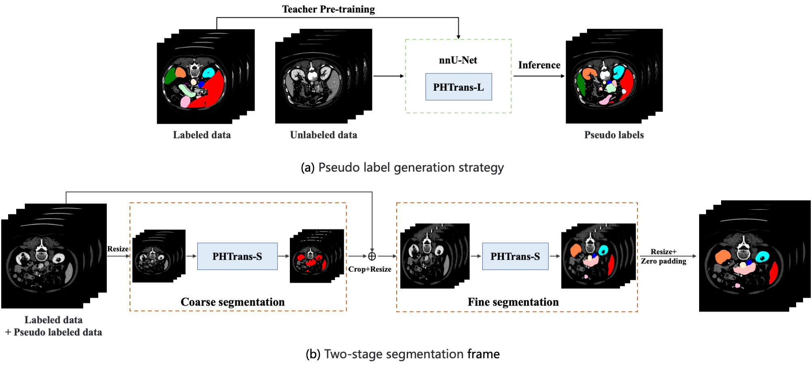

# Two-stage PHTrans for Abdominal Organ Segmentation

This repository is a solution for the [MICCAI FLARE2022 challenge](https://flare22.grand-challenge.org/). A detailed description of the method introduction, experiments and analysis of the results for this solution is presented in paper : [Combining Hybrid Architecture and Pseudo-label for Semi-supervised Abdominal Organ Segmentation](https://arxiv.org/abs/2207.11512). 

<div align="center">
  
</div>

 
## Prerequisites
 

 
Download our repo:
```
git clone https://github.com/lseventeen/PHTrans.git
cd PHTrans
```
Install packages
```
cd nnUNet
pip install -e .

cd PHTrans
pip install -e .
```
 
## Datasets processing
Download datasets [BCV](https://www.dropbox.com/sh/z4hbbzqai0ilqht/AAARqnQhjq3wQcSVFNR__6xNa?dl=0https://www.dropbox.com/sh/z4hbbzqai0ilqht/AAARqnQhjq3wQcSVFNR__6xNa?dl=0) and [ACDC](https://acdc.creatis.insa-lyon.fr/description/databases.html). Type this in the terminal to perform dataset partitioning followed by [nnFormer](https://github.com/282857341/nnFormer). 
 
```
PHTrans_BCV -dataset_path DATASET_PATH
PHTrans_ACDC -dataset_path DATASET_PATH
```
Preprocess the BCV and ACDC datasets according to the uploaded nnUNet package
## Training
Type this in terminal to run train
 
```
PHTrans_train -task 17OR27 
```
## Test
Type this in terminal to test:
 
```
PHTrans_train -task 17OR27 -eei EXPERIMENT_ID -val
```
To replicate the results in the paper, we have prepared the [download link](https://drive.google.com/drive/folders/1lzj8SJgwGQG-lP9D-pzB1y6RNa6pzVsv?usp=sharing) of pre-trained models.

## Acknowledgements


The 3D Swin Transformer block of PHTrans refers to the source code repository of [Swin Transformer](https://github.com/microsoft/Swin-Transformer) and part of codes are reused from the [nnU-Net](https://github.com/MIC-DKFZ/nnUNet). Thanks to Liu Ze and Fabian Isensee for the open source code.
